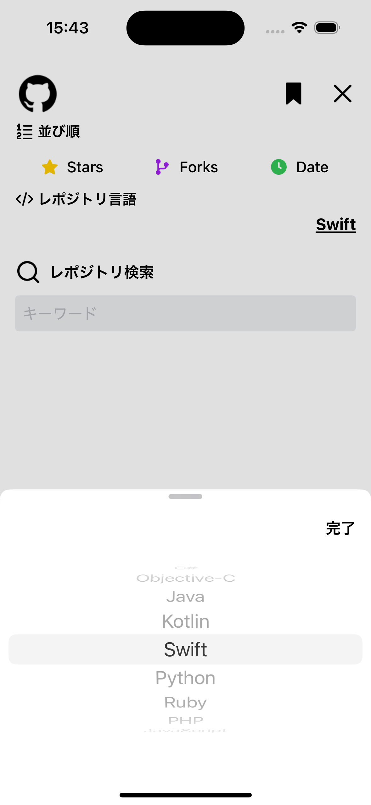
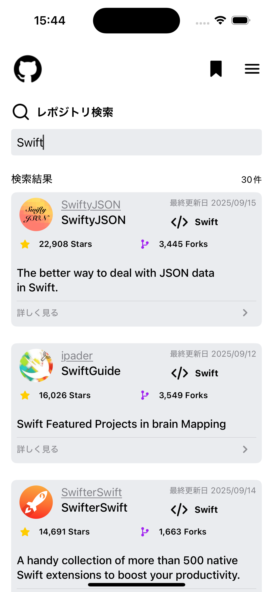

# 📖 README.md

# GithubSearch (iOS SwiftUI)

GitHub の REST API（Search API）を利用し、入力したクエリ文字列からリポジトリを検索・一覧表示する iOS アプリです。  
UI は **SwiftUI**、非同期処理は **async/await** を活用し、MVVM アーキテクチャに基づいて構築されています。

---

## 🚀 プロジェクト概要

- ユーザーが検索クエリを入力し、GitHub Search API を呼び出してリポジトリ一覧を取得・表示
- 名前（必須）に加えて、スター数・所有者アバター・説明・更新日時・言語などの情報を表示
- ソート（stars/forks/updated）、言語フィルター、ページネーション対応
- API レートリミットを考慮し、**ディバウンス処理**・**キャンセル制御**を実装
- iOS 16+ 対応

---

## 🏛 アーキテクチャ

本アプリは **MVVM + UseCase + Manager** の構成を採用。

1. **Service 層**

   - API 通信を担当 (`SearchRepositoriesService`)
   - URLSession を async/await で利用

2. **UseCase 層**

   - API パラメータの組み立て・検証 (`SearchRepositoriesUsecase`)

3. **Manager 層**

   - ディバウンス・キャンセル制御・ページ管理を統括 (`SearchRepositoriesManager`)

4. **ViewModel 層**

   - 状態管理（`SearchRepositoryState`）とアクション受付 (`SearchRepositoriesViewModel`)

5. **View 層 (SwiftUI)**
   - 検索入力、リスト表示、フィルター、ソート、エンプティビュー、エラーメッセージ
   - Skeleton 表示や Shimmer を利用し、UX を向上

---

## 🧪 テスト

- **Nimble + Quick** を用いた単体テスト
- テスト対象:
  - `SearchRepositoriesServiceTests` → API レスポンス検証
  - `SearchRepositoriesManagerTests` → ディバウンス, キャンセル, onError 呼び出し確認
  - `SearchRepositoriesViewModelTests` → 状態遷移、ページ管理
  - `SearchRepositoriesDecodingTests` → JSON デコード
  - Fixture: 成功/失敗レスポンス JSON を保持

---

## ⚠️ 工夫点

- **ディバウンス処理**: 検索キーワードの変更によるリクエスト制御
- **キャンセル制御**: 新しい検索開始時に古いリクエストをキャンセル
- **レートリミット対策**: 残リクエスト回数を UI 上に表示
- **Sendable/Actor 対応**: Swift 6 の並行性チェックに準拠
- **モジュール分割**: Configs / Extensions / Modifiers / Features / Service と整理

---

## 📱 対応環境

- **iOS**: 16.0+
- **Swift**: 6
- **Xcode**: 16.4

---

## 📌 今後の改善アイデア

- お気に入り登録・ローカル保存機能
- レポジトリの詳細画面
- より高度なテスト（Snapshot テスト / Integration テスト）

---

## 📸 スクリーンショット

   
   
   

